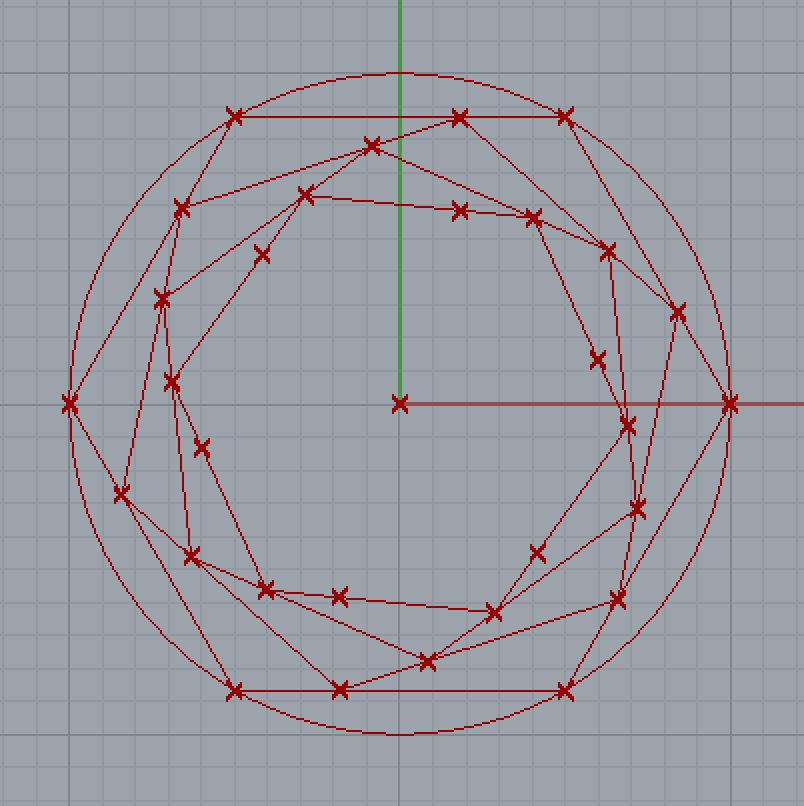

[Home](../README.md) > [Rhino+GH](./README.md) > Tutorial 1

# Rhino & Grasshopper: Basics

Download: [example 1](example-1-1.gh) | [example 2](example-1-2.gh)

## Part 1 (Rhino)

* UI and workspace: menu, toolbar, viewport, command line
* Create simple boxes
* Navigation in viewport: pan, zoom, rotate 工作視窗內瀏覽（運鏡）
* Zoom extents, zoom selected, hide/unhide 畫面縮放、隱藏物件
* Left mouse button & right mouse button 滑鼠左右鍵的多重作用
* Object selection: single, multiple, add to, remove from, marquee selection 物件選取方法
* Cartesian coordinate system, axis 座標系、平面（工作面）
* Point, Line

```
Exercise: Learn to navigate yourself in the viewports by mouse and keyboard.
練習：熟悉工作視窗中用滑鼠和鍵盤進行攝影機瀏覽。
```

## Part 2 (Rhino)

* Grid Snap, Osnap (Object Snap), Gumball 鎖點、鎖物件與快速調整工具
* Copy and paste
* Command prompt 命令列、指令、參數、手動輸入
* Curve, control points, periodic curve (closed curve) 曲線、曲線控制點、週期性曲線
* Boolean operations: union, difference, intersection 布林運算
* Solid objects, object properties 實體物件、物件屬性
* Explode, Join, Surface & polysurface 爆炸（拆解）、結合

```
Exercise: Create 20 boxes with various sizes and transformations as fast as possible -- in a smart way.
練習：嘗試在最短時間內建立 20 個大小、旋轉、縮放皆不同的方盒子，盡可能用聰明的方法。
```

## Part 3 (Grasshopper)

* How Grasshopper work with Rhino?
* UI and workspace: menu, toolbar, component tabs
* Param components as containers 參數元件作為資料容器（變數）
* Number slider and Panel 數值滑桿、便利貼（資料面板）
* Inputs and Outputs of a component 元件的輸出入
* Linked components and chain-link 元件間的連鎖關係
* Point, Line segment, Linked lines
* Series (number series) 數值序列
* Circle and its properties
* Data pairing (longest & shortest) 資料配對（最長、最短配對法）
* Data pairing (cross-reference) 資料配對（交叉配對法）
* Range (number range), Domain 數值範圍、值域
* Random numbers 亂數

```
Exercise: Observe the result of data pairing by using different components and data lists.
練習：用不同元件和資料串列，嘗試不同的配對方式，觀察配對結果。
```

## Part 4 (Grasshopper)

* Curve, planar curve & spatial curve
* `Point on Curve` component: Pros & Cons 曲線上取點（以及優缺點）
* `Evaluate Curve` component: Pros & Cons 曲線估值（以及優缺點）
* `Divide Curve` component 曲線分段取點
* `Shift List` component 資料串列移位
* Reparameterize 重新參數化



```
Exercise:
- Divide a circle into N points.
- Connect points to their neighboring points and yield N line segments.
- Find midpoints in the segments.
- Connect these midpoints to their neighboring points.
- Repeat this process for 3-4 times.
練習：
- 將一圓分為 N 段，得到 N 點。
- 將每個點連接到隔壁點，建立 N 條線段。
- 在所有線段上取中點，再連結這些中點與隔壁點，形成漩渦狀圖案。
- 重複此操作 3-4 次。
```

## Homework
尋找感興趣、具重複性、具規則性的圖騰或圖案，研究其幾何構圖規則，試著用 Grasshopper 建構出來。（局部即可）
